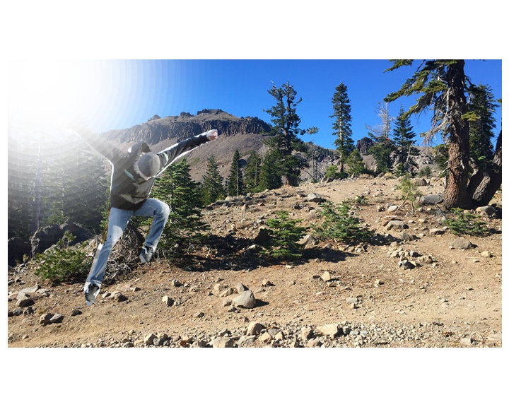

# Gorunur Isik Veriseti Uretimi
## Kurulum

Gerekli python paketlerini indirmek icin:
```
pip install requirements.txt
```

Sentetik veriseti uretiminde kullanilacak olan MS COCO (https://cocodataset.org/#home) dosyalarini indirmek icin ise kullanilacak olan komut:
```
cd scripts/ && python data_downloader.py
```

Indirme islemi uzun surebilecegi icin manuel olarak alttaki dosyalar linkten indirilip `gorunur_isik_sentetik_veriseti/data` adresine unzip edilebilir.
```
http://images.cocodataset.org/annotations/annotations_trainval2017.zip
http://images.cocodataset.org/zips/train2017.zip
http://images.cocodataset.org/zips/val2017.zip
```

## Veriseti Olusturulmasi

Sentetik veri setinin olusturulmasi icin su asamalar izlenir:

1) Arkaplan gorsellerinden birinin random olarak secilmesi, `gorunur_isik_sentetik_veriseti/data/background` klasorunden bir adet gorsel yuklenir.
2) Her sinif `insan, arac, hayvan` icin esit sayida sentetik veri olusacak sekilde MS COCO verisetinden annotation objelerinden biri random sekilde secilir. Secilen obje pixel yuksekligi ve genisligi bakimindan 150 pixel'den buyuk olmak zorundadir.
3) Secilen obje uzerine -15, 15 dereceler arasinda rotation, horizontal flip, scale 0.25 - 2.0 arasinda boyut degistirme gibi transformlar uygulanip arkaplan gorseli uzerine rastgele bir konuma yerlestirilir.
4) Olusan arkaplan + nesne iceren gorsel uzerine Data Augmentation teknikleri uygulanir.

Verisetini olusturmak icin  `gorunur_isik_sentetik_veriseti/create_dataset.ipynb` Jupyter Notebook'u kullanilabilir. Her siniftan kac adet ornek olusmasini belirlemek icin ilk hucredeki `num_samples_per_class` degiskeni kullanilmaktadir.

## Ornek Sentetik Veri Olusumu

Asama 1 sonrasi rasgele secilmis arka plan gorseli:


Asama 2 sonrasi MS COCO verisetinden rasgele `insan, arac, hayvan` objelerinden goruntunun orijinali ve mask gorseli:


Asama 3 ve 4 sonrasi olusabilecek `insan` sinifina ait sentetik gorseller ise:

-Gunes parlamasi data augmentation yontemi eklenmis.


-Blur data augmentation yontemi eklenmis.

